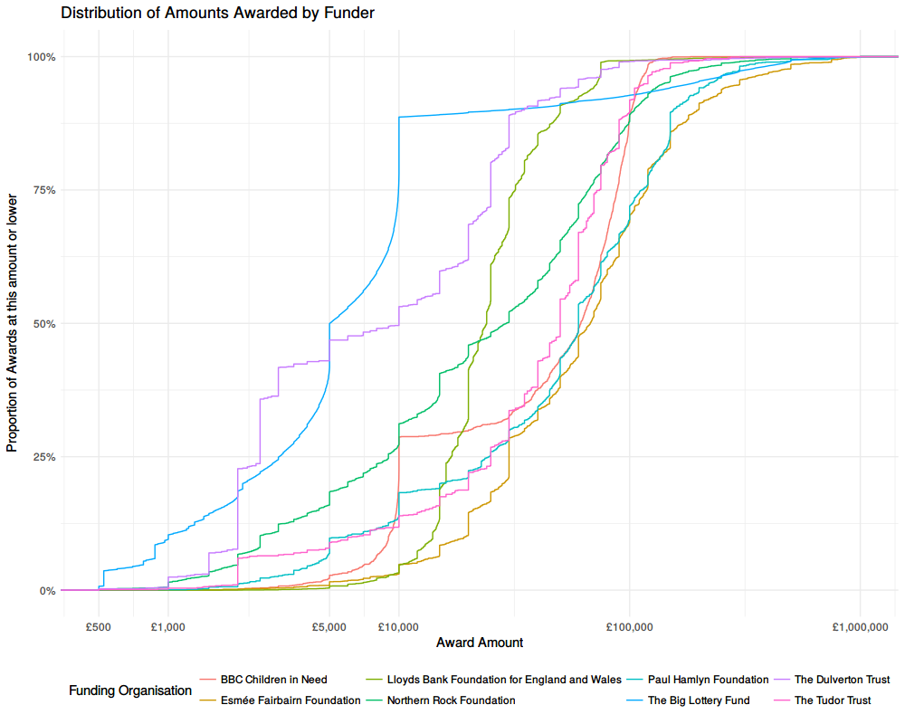

# Exploring Grant Awards in the UK

[GrantNav](http://grantnav.threesixtygiving.org/) brings together information about grants awarded by a variety of funders in the UK. Because the data is published with a common standard, it's easy to create analyses and visualisations that a) work for any of the funders' data and b) can compare grant portfolios across funders.

You can [download the whole dataset as a csv file](http://grantnav.threesixtygiving.org/developers). It's also available to browse in GrantNav, a [360Giving](http://www.threesixtygiving.org/) application released under the terms of the [Creative Commons Attribution Sharealike License (CC-BY-SA)](https://creativecommons.org/licenses/by-sa/4.0/). Please see GrantNav's [copyright and attribution](http://grantnav.threesixtygiving.org/datasets/#copyright) list for details on the original data sources.

The grants.csv table has a row per award with columns describing a variety of attributes such as date of award, amount awarded, recipient, funder and beneficiary.

We created some exploratory visualisations of this data at last months' Open Data Manchester workshop - "Getting to Grips with Data". The idea with exploratory analysis is that you start with some data and you simply want to know what is there - to uncover the shape and scope. You can get to grips with a dataset by understanding what dimensions or variables it includes and what values those variables take. You would typically use summaries like frequency tables, cross tabulations, and distributional analysis. These statistical descriptions provide views into the data which quickly provoke questions about the patterns within.

One aspect we chose to explore was the size of grants awarded (in the `Amount Awarded` column). Two things soon became apparent: first, that each funder has a very different award portfolio, and second, that the amounts tended to cluster around certain values. This seemed intuitive - since funding is often offered with specific thresholds, we might expect applicants to design their projects with these in mind, asking for more or less money than they might otherwise have done.

We settled on an analysis called a "cumulative frequency distribution" as a way of visualising these aspects. We'll explain this in detail below, but, since a picture speaks a thousand words, we invite you to take a look at the chart first. Feel free skip the technical description and jump to read about the conclusions we can draw from this data graphic.

## What is a cumulative frequency distribution?

A frequency distribution tells us how common certain values are across a range. Whereas an average provides a summary of a set of values by telling us about the middle, a frequency distribution tells us about the middle, ends and all the values in between. The same average value can arise from many different distributions (e.g. a few very small values and many large ones or many small values and a few very large ones). The distribution is calculated by taking a range (e.g. £0 - £1,000,000), then dividing it into bins (e.g. £0-99, £100-999, £1,000-4,999 ...), then counting the number of values that fall into each bin - aka the frequency (e.g. £0-99: 100 grants, £100-999: 363 grants, £1,000-4,999: 789 grants etc). These can be a bit tricky to interpret however, as the frequency depends upon the bin size.

A cumulative frequency distribution take a cumulative tally of frequencies. Whereas a frequency distribution might say "there were x awards between 10,000-15,000" a cumulative distribution would say "there were x awards up to 15,000". This makes the interpretation slightly easier as we can say "x awards were less than £y". In order to compare funders - who each make different numbers of awards - we've transformed the frequencies into a proportion by dividing by the total number of awards made by each - i.e. "x% of awards at were less than £y".

## How should I interpret the chart?

We can then plot the cumulative frequency distribution - here we've mapped the amount awarded on to the horizontal x-axis and the cumulative proportion of award by number on to the vertical y-axis.

Given that distribution is highly skewed (there are many small grants, and few large ones) we've transformed the x-axis using a logarithmic scale (with base 10). That means that each step along the scale represents a 10 fold increase in the £ amount (a typical linear scale would map an constant £ amount for each step). Practically speaking, this helps to spread the curves out across the graphic so that they're easier to distinguish and not bunched-up on the left, making better use of the space available.

The curves show the proportion of each funder's awards that were made up to a given size of award. Flatter vertical segments indicate many awards being made with that amount, flatter horizontal segments indicate fewer awards being made over a range of amounts. Where one curve is above another, that indicates that they focus more of their awards at that level (i.e. making more awards by number, relative to the total number in their portfolio).

## What does this analysis tell us about grant funding in the UK?

Let's return to the chart again. What can you see?

There are clear vertical segments around funding thresholds. This is most obvious in the case of the Big Lottery Fund, around the £5,000 and £10,000 mark.

We can also see some funders focus on a narrow range - the Lloyds Bank Foundation, for example, makes around 90% of it's awards between £10,000 and £50,000 - whereas the Dulverton Trust and the Northern Rock Foundation have a much broader spread.

The BBC's Children in Need fund does have an obvious threshold at £10,000, like the Big Lottery Fund, but actually makes most of its awards at a higher level (up to around £100,000).

The Esmée Fairbairn Foundations - the right-most curve across most of the range, focusses on larger awards with around a third over £100,000.

## How do I make one of these?

You will no doubt be able to make other comparisons, and draw other conclusions from the graphic. Indeed it probably provokes more questions. What would this look like in terms of proportion of funding by value (instead of by number of awards)? How does this compare in absolute terms (i.e. overall number of awards, not proportion)? What about the smaller funders we removed to make the chart easier to read?!

If you'd like to find answers to those questions, or explore other parts of the dataset, then you can find the [R code used to generate the analysis and graphics on github](https://github.com/Robsteranium/g2gwd). We introduce the `data.table` library used to make summary tables and the `ggplot2` library used to design and create the visualisations. You can also follow-along with the exploration process and find links to learning resources in the comments placed throughout the source-code.

